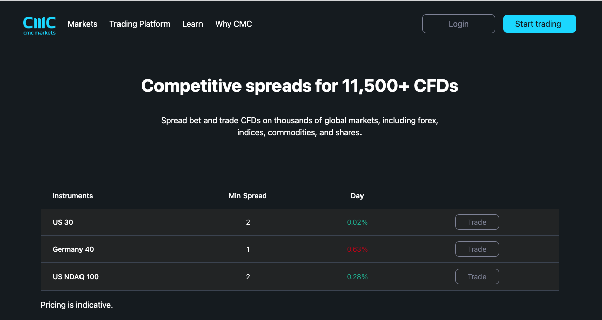

# CMC Markets

## How to Run?

- clone the repo
- Install dependencies `yarn` or `npm install` from root folder
- Run : `yarn dev` or `npm run dev` 
- Build : `yarn build` or `npm run build`

## Docs

- Stack : `vite.js` , `Tailwind CSS`, `Fetch API` 
- Config : `modules/config.js` and `tailwindcss.config.cjs`
- Build location : `/dist`